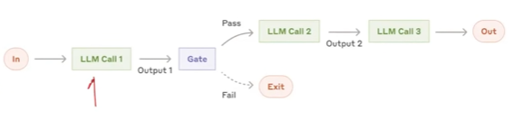
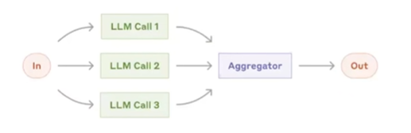
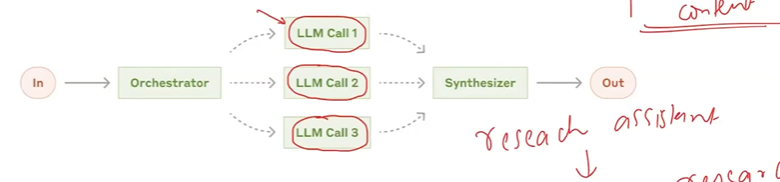
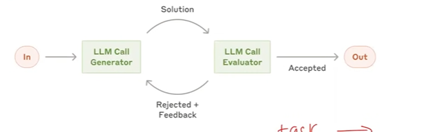

# LangGraph Core

Core components and utilities for the LangGraph project.

## Overview

- LangGraph is an orchestration framework for building intelligent, stateful, and
multi-step LLM workflows.

- It enables advanced features like parallelism, loops, branching, memory, and
resumability - making it ideal for agentic and production-grade Al applications.

- It models your logic as a graph of nodes (tasks) and edges (routing) instead of a
linear chain.

# LLM Workflows

1. LLM workflows are a step by step process using which we can build complex
LLM applications or series of task to acheive a goal.

2. Each step in a workflow performs a distinct task - such as prompting,
reasoning, tool calling, memory access, or decision-making.

3. Workflows can be linear, parallel, branched, or looped, allowing for complex
behaviours like retries, multi-agent communication, or tool-augmented
reasoning.

4. Common workflows

1. Prompt Chaining

- Short definition: Prompt chaining is breaking a complex task into a sequence of simpler prompts where each prompt uses the previous prompt's output as input.
- How it works: solve one subtask at a time → pass its result to the next prompt → compose final output from intermediate results.
- Why use it: improves reliability, control, and traceability for complex requests.

2. Routing

- Routing workflow: direct each incoming task/request to the correct handler or service (based on rules, metadata, or content) so the right component processes it.
- Example: incoming message → identify intent → route to FAQ handler or Support agent → return response.

3. Parallelization

- Parallelization in LLM workflows: run multiple independent LLM calls or tasks at the same time (threads/processes/workers) to reduce latency and increase throughput.

- OR : For a given task, break it into multiple subtasks, execute all subtasks concurrently, and then merge their results into the final outcome.

4. Orchestrator Workers

- Definition: Orchestrator workers are components that schedule, execute, and monitor workflow nodes (tasks) in an LLM graph, coordinating concurrent runs, retries, and state transitions.
- Role: accept assigned node work, run the task (LLM call/tool), report results/state back to the orchestrator, and handle failures or timeouts.
- Example: orchestrator dispatches 5 workers to run parallel scoring tasks; each worker runs an LLM prompt, returns scores, and the orchestrator merges results and advances the graph.

5. Evaluator Optimizer

- Definition: a component that scores, ranks, and selects (or merges) candidate outputs from LLMs or workers to produce the best final result.
- Role: evaluate multiple responses using metrics (accuracy, relevance, fluency, cost), pick or ensemble the best, and feed feedback to improve prompts or routing.
- Example: generate 5 candidate summaries → score each for factuality and coverage → choose the highest-scoring summary or combine key points into one consolidated summary.

# GRAPHS, NODES AND EDGES

1. GRAPH
- A Graph in LangGraph is the overarching structure that maps out how different tasks (nodes) are connected and executed.
- It visually represents the workflow, showing the sequence and conditional paths between various operations

Analogy:
- Road Map: A road map displaying the different routes connecting cities, with intersections offering choices on which path to take next.

2. NODE
- Nodes are individual functions or operations that perform specific tasks within the graph.
- Each node receives input (often the current state), processes it, and produces an output or an updated state.

Analogy:
- Assembly Line Stations: Each station does one job-attach a part, paint it, inspect quality, and so on.

3. EDGES
- Edges are the connections between nodes that determine the flow of execution.
- They tell us which node should be executed next after the current one completes its task.

Analogy:
- Train Tracks: Each track (edge) connects the stations (nodes) together in a specific direction.

# STATE

1. STATE
- The State is a shared data structure that holds the current information or context of the entire application.
- In simple terms, it is like the application's memory, keeping track of the variables and data that nodes can access and modify as they execute.

Analogy:
- Whiteboard in a Meeting Room: Participants (nodes) write and read information on the whiteboard (state) to stay updated and coordinate actions.

# EXAMPLE GRAPH FLOW

### Graphs, Nodes and Edges

The system generates an essay topic, collects the student's submission, and
evaluates it in parallel on depth of analysis, language quality, and clarity of
thought. Based on the combined score, it either gives feedback for improvement
or approves the essay.

1. GenerateTopic
- System generates a relevant UPSC-style essay topic and presents it to the student.

2. CollectEssay
- Student writes and submits the essay based on the generated topic.

3. EvaluateEssay (Parallel Evaluation Block)
- Three evaluation tasks run in parallel:
    - EvaluateDepth - Analyzes depth of analysis, argument strength, and critical thinking.
    - EvaluateLanguage - Checks grammar, vocabulary, fluency, and tone.
    - EvaluateClarity - Assesses coherence, logical flow, and clarity of thought.

4. AggregateResults
- Combines the three scores and generates a total score (e.g., out of 15).

5. ConditionalRouting
- Based on the total score:
    - If score meets threshold - go to ShowSuccess
    - If score is below threshold - go to GiveFeedback

6. GiveFeedback
- Provides targeted suggestions for improvement in weak areas.

7. CollectRevision (optional loop)
- Student resubmits the revised essay.
- Loop back to EvaluateEssay

8. ShowSuccess
- Congratulates the student and ends the flow.